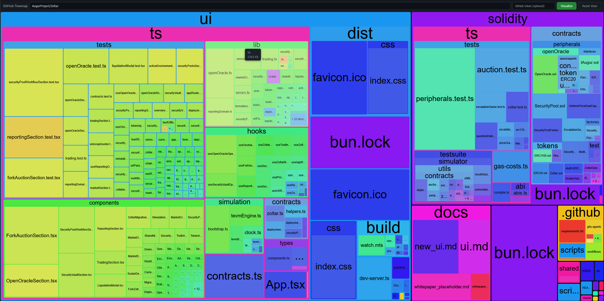

# GitHub Size Treemap

A purely local treemap visualization of file sizes in a GitHub repository.

The app runs entirely in the browser with no backend — all data is fetched directly from the GitHub API from your browser.  Does not phone home in any way.

**Live site:** https://micahzoltu.github.io/github-size-treemap/

**Run locally:** Download or clone this repository and open `index.html` in your browser.
